# Elsa Workflows - Contributor Glossary

**Audience**: Developers contributing to the Elsa codebase
**Purpose**: Internal architecture reference for understanding and extending Elsa
**Companion Document**: See [Brownfield Architecture Document](./architecture.md) for detailed explanations

---

## Table of Contents

- [Core Terms](#core-terms)
- [Domain Entities](#domain-entities)
- [Visual Guides](#visual-guides)
  - [Module Dependency Graph](#module-dependency-graph)
  - [Pipeline Architecture](#pipeline-architecture)
  - [Feature Registration System](#feature-registration-system)
  - [Store Architecture](#store-architecture)
  - [Expression Handler Architecture](#expression-handler-architecture)
  - [Activity Registration Flow](#activity-registration-flow)
  - [State Extraction and Materialization](#state-extraction-and-materialization)
  - [Middleware Pipeline Execution](#middleware-pipeline-execution)
  - [Dependency Injection Structure](#dependency-injection-structure)
  - [Build System Workflow](#build-system-workflow)
  - [Test Organization](#test-organization)
  - [Pull Request Workflow](#pull-request-workflow)
  - [Activity Descriptor Generation](#activity-descriptor-generation)
  - [Bookmark Resolution Flow](#bookmark-resolution-flow)
  - [Actor Model Integration](#actor-model-integration)
  - [Persistence Provider Architecture](#persistence-provider-architecture)
  - [CQRS/Mediator Pattern](#cqrsmediator-pattern)
  - [Workflow Materialization](#workflow-materialization)
- [Cross-References](#cross-references)

---

## Core Terms

### Activity Descriptor
Metadata about an activity type, generated via reflection. Contains information about ports, inputs, outputs, display name, category, etc.

**Generated by**: `IActivityDescriber`
**Used by**: Designer, serialization, validation
**Location**: `src/modules/Elsa.Workflows.Core/Services/ActivityDescriber.cs`

**See**: [Architecture Doc - Activity Model](./architecture.md#activity-model)

---

### Activity Execution Pipeline
A middleware-based pipeline that processes activity execution. Each middleware can intercept before/after activity execution.

**Stages**:
1. Evaluation (check CanExecuteAsync)
2. Execution (call ExecuteAsync)
3. Bookmarking (handle created bookmarks)
4. Logging (record execution)

**Location**: `src/modules/Elsa.Workflows.Core/Pipelines/ActivityExecution/`

**See**: [Architecture Doc - Pipeline Architecture](./architecture.md#pipeline-architecture)

---

### Activity Provider
Service that discovers and registers activities from assemblies. Scans for types decorated with `[Activity]` attribute.

**Interface**: `IActivityProvider`
**Default Implementation**: `TypedActivityProvider`
**Location**: `src/modules/Elsa.Workflows.Core/Services/ActivityProvider.cs`

---

### Activity Registry
Central registry of all available activity types in the system. Used for serialization, deserialization, and activity discovery.

**Interface**: `IActivityRegistry`
**Location**: `src/modules/Elsa.Workflows.Core/Contracts/IActivityRegistry.cs`

---

### Behavior
Reusable logic that can be attached to activities. Behaviors execute around activity execution.

**Example**: `AutoCompleteBehavior` (automatically completes activities when ExecuteAsync returns)

**Interface**: `IBehavior`
**Location**: `src/modules/Elsa.Workflows.Core/Contracts/IBehavior.cs`

---

### Bookmark Payload
Activity-specific data stored with a bookmark, used for resumption. Must be JSON-serializable.

**Examples**:
- `HttpEndpoint`: HTTP method, route, correlation info
- `Timer`: Scheduled time
- `MessageReceived`: Queue name, message type

---

### Commit State Handler
Manages transactional state changes during workflow execution. Ensures state modifications are committed atomically.

**Interface**: `ICommitStateHandler`
**Location**: `src/modules/Elsa.Workflows.Core/State/`

---

### Expression Evaluator
Service that evaluates expressions using registered expression handlers. Routes expressions to appropriate language handlers.

**Interface**: `IExpressionEvaluator`
**Location**: `src/modules/Elsa.Expressions/Services/ExpressionEvaluator.cs`

**See**: [Architecture Doc - Expression System](./architecture.md#expression-system)

---

### Expression Handler
Implements evaluation logic for a specific expression language (C#, JavaScript, Python, Liquid).

**Interface**: `IExpressionHandler`
**Implementations**:
- `CSharpExpressionHandler` (Roslyn)
- `JavaScriptExpressionHandler` (Jint)
- `PythonExpressionHandler` (pythonnet)
- `LiquidExpressionHandler` (Fluid)

**Location**: `src/modules/Elsa.Expressions.*/`

---

### Feature
A modular unit that configures services and registers components. Features compose to build Elsa's functionality.

**Base Class**: `FeatureBase`
**Methods**:
- `Configure()` - Configure feature options
- `Apply()` - Register services with DI
- `ConfigureHostedServices()` - Register background services

**Location**: `src/common/Elsa.Features/Abstractions/FeatureBase.cs`

**See**: [Architecture Doc - Feature System](./architecture.md#modulefeature-system)

---

### Identity Generator
Service that generates unique identifiers for workflows, activities, bookmarks, etc.

**Interface**: `IIdentityGenerator`
**Default**: Short GUID generator
**Location**: `src/modules/Elsa.Workflows.Core/Services/IdentityGenerator.cs`

---

### Incident
A recorded error or fault that occurred during workflow execution. Stored with workflow state for debugging.

**Entity**: `ActivityIncident`
**Properties**: Exception message, stack trace, timestamp, activity node ID
**Location**: `src/modules/Elsa.Workflows.Core/Models/ActivityIncident.cs`

---

### Materializer
Service that deserializes workflow definitions into executable workflow graphs. Different materializers for JSON, code-based, etc.

**Interface**: `IWorkflowMaterializer`
**Location**: `src/modules/Elsa.Workflows.Management/Materializers/`

---

### Mediator
CQRS-style messaging system for commands and notifications. Enables decoupled communication between modules.

**Interfaces**:
- `ICommandSender` - Send commands
- `INotificationSender` - Send notifications
- `ICommandHandler<T>` - Handle commands
- `INotificationHandler<T>` - Handle notifications

**Location**: `src/common/Elsa.Mediator/`

---

### Middleware
A component in a pipeline that can intercept and process execution flow. Used in both workflow and activity pipelines.

**Signature**: `ValueTask InvokeAsync(TContext context, TDelegate next)`

---

### Module
A logical grouping of features and services. Modules can depend on other modules.

**Interface**: `IModule`
**Location**: `src/common/Elsa.Features/Abstractions/IModule.cs`

---

### Property UI Handler
Determines how activity properties are rendered in the designer. Provides UI hints and configuration.

**Interface**: `IPropertyUIHandler`
**Location**: `src/modules/Elsa.Workflows.Core/Contracts/IPropertyUIHandler.cs`

---

### Scheduler
Manages execution order of activities. Determines which activities run and in what sequence.

**Interface**: `IActivityScheduler`
**Default**: `DefaultActivityScheduler`
**Location**: `src/modules/Elsa.Workflows.Core/Services/ActivityScheduler.cs`

---

### State Extractor
Extracts serializable state from a running workflow execution context. Converts runtime state to `WorkflowState`.

**Interface**: `IWorkflowStateExtractor`
**Location**: `src/modules/Elsa.Workflows.Core/State/WorkflowStateExtractor.cs`

---

### Store
Repository abstraction for persistence. Follows filter-based query pattern.

**Key Stores**:
- `IWorkflowDefinitionStore` - Workflow definitions
- `IWorkflowInstanceStore` - Workflow instances
- `IBookmarkStore` - Bookmarks
- `ITriggerStore` - Triggers

**Location**: `src/modules/Elsa.Workflows.Management/Contracts/`

**See**: [Architecture Doc - Persistence Layer](./architecture.md#persistence-layer)

---

### Trigger Indexer
Scans workflow definitions for trigger activities and registers them with the runtime.

**Interface**: `ITriggerIndexer`
**Location**: `src/modules/Elsa.Workflows.Runtime/Contracts/ITriggerIndexer.cs`

---

### Workflow Builder
Fluent API for building workflows programmatically in C#.

**Class**: `WorkflowBuilder`
**Location**: `src/modules/Elsa.Workflows.Core/Builders/WorkflowBuilder.cs`

---

### Workflow Graph
Compiled representation of a workflow with all activities and connections organized into a traversable graph structure.

**Class**: `WorkflowGraph`
**Properties**: Root node, node lookup, connections
**Location**: `src/modules/Elsa.Workflows.Core/Models/WorkflowGraph.cs`

---

### Workflow Runner
High-level service for executing workflows. Handles instantiation, execution, and state management.

**Interface**: `IWorkflowRunner`
**Location**: `src/modules/Elsa.Workflows.Core/Contracts/IWorkflowRunner.cs`

---

### Workflow Runtime
Orchestrates workflow lifecycle: starting, resuming, canceling workflows. Entry point for workflow operations.

**Interface**: `IWorkflowRuntime`
**Location**: `src/modules/Elsa.Workflows.Runtime/Contracts/IWorkflowRuntime.cs`

---

## Domain Entities

### ActivityExecutionContext (Implementation)

**Purpose**: Runtime context for activity execution

**Key Properties**:
- `Id` - Unique execution context ID
- `WorkflowExecutionContext` - Parent workflow context
- `ParentActivityExecutionContext` - Parent activity (for nested)
- `Activity` - The activity being executed
- `ActivityDescriptor` - Metadata about activity
- `ExpressionExecutionContext` - For expression evaluation
- `Properties` - Transient key-value storage
- `ActivityState` - Persistent activity state
- `ActivityInput` - Evaluated input values
- `Tag` - Optional context tag

**Key Methods**:
- `ScheduleActivityAsync()` - Schedule child activity
- `CompleteActivityAsync()` - Mark activity complete
- `CreateBookmark()` - Create bookmark for resumption
- `GetRequiredService<T>()` - Resolve service from DI

**Location**: `src/modules/Elsa.Workflows.Core/Contexts/ActivityExecutionContext.cs`

---

### WorkflowExecutionContext (Implementation)

**Purpose**: Runtime context for workflow execution

**Key Properties**:
- `Id` - Workflow instance ID
- `CorrelationId` - Correlation identifier
- `WorkflowGraph` - Compiled workflow structure
- `Status` - Workflow status enum
- `SubStatus` - Detailed sub-status
- `Scheduler` - Activity scheduler
- `Bookmarks` - Active bookmarks
- `Incidents` - Recorded errors
- `Input` - Workflow input dictionary
- `Output` - Workflow output dictionary
- `Properties` - Transient properties
- `ExpressionExecutionContext` - Root expression context

**Key Methods**:
- `CreateAsync()` - Factory for new contexts
- `ScheduleActivityAsync()` - Schedule activity execution
- `ExtractWorkflowState()` - Extract serializable state
- `AddBookmark()` - Register bookmark

**Location**: `src/modules/Elsa.Workflows.Core/Contexts/WorkflowExecutionContext.cs`

---

### ActivityDescriptor (Implementation)

**Purpose**: Metadata describing an activity type

**Key Properties**:
- `TypeName` - Fully qualified type name
- `Version` - Activity version
- `Category` - UI category
- `DisplayName` - Human-readable name
- `Description` - Activity description
- `Inputs` - Collection of input descriptors
- `Outputs` - Collection of output descriptors
- `Ports` - Collection of port descriptors
- `CustomProperties` - Additional metadata

**Generated By**: `IActivityDescriber` via reflection

**Location**: `src/modules/Elsa.Workflows.Core/Models/ActivityDescriptor.cs`

---

### WorkflowState (Serialization)

**Purpose**: Serializable snapshot of workflow execution

**Key Properties**:
- `Id` - Instance ID
- `DefinitionId` / `DefinitionVersionId` - Which definition
- `Status` / `SubStatus` - Execution status
- `Bookmarks` - Active bookmarks
- `ActivityExecutionContexts` - Execution stack
- `ScheduledActivities` - Pending activities
- `CompletionCallbacks` - Activity completion handlers
- `Incidents` - Errors
- `Input` / `Output` / `Properties` - Data dictionaries

**Persistence**: Serialized to JSON and stored via `IWorkflowInstanceStore`

**Location**: `src/modules/Elsa.Workflows.Core/State/WorkflowState.cs`

---

### Filter Objects

**Purpose**: Type-safe query filters for stores

**Examples**:
- `WorkflowDefinitionFilter` - Query workflow definitions
- `WorkflowInstanceFilter` - Query workflow instances
- `BookmarkFilter` - Query bookmarks

**Pattern**: Fluent API with optional properties for composable queries

**Location**: `src/modules/Elsa.Workflows.Management/Filters/`

---

### Bookmark (Internal)

**Purpose**: Internal bookmark representation with metadata

**Key Properties**:
- `Id` - Unique bookmark ID
- `Name` - Bookmark type/name
- `Hash` - For matching with stimuli
- `Payload` - Serializable activity data
- `ActivityNodeId` - Which activity created it
- `CorrelationId` - For correlation
- `WorkflowInstanceId` - Which instance

**Resolution**: Matched via hash when external events arrive

**Location**: `src/modules/Elsa.Workflows.Core/Models/Bookmark.cs`

---

### Command / Notification (CQRS)

**Purpose**: Mediator messages for decoupled communication

**Command Example**:
```csharp
public class SaveWorkflowDefinitionCommand : ICommand<WorkflowDefinition>
{
    public WorkflowDefinition Definition { get; set; }
}
```

**Notification Example**:
```csharp
public class WorkflowExecuting : INotification
{
    public WorkflowExecutionContext WorkflowExecutionContext { get; set; }
}
```

**Location**: `src/modules/Elsa.*/Commands/` and `src/modules/Elsa.*/Notifications/`

---

### Feature Module Metadata

**Purpose**: Describes feature dependencies and configuration

**Attributes**:
- `[DependsOn(typeof(OtherFeature))]` - Feature dependency
- `[Feature]` - Feature metadata

**Resolution**: Feature dependency graph resolved at startup

**Location**: `src/common/Elsa.Features/Attributes/`

---

## Visual Guides

### Module Dependency Graph

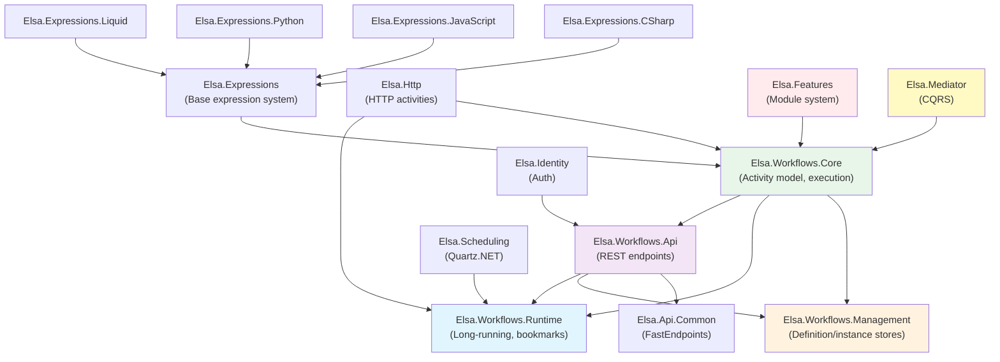

**Description**: Module dependency structure. Core is foundational; Management, Runtime, and API build on it.

**Key Points**:
- **Core**: No dependencies (except Features, Mediator)
- **Management**: Depends on Core (definition/instance persistence)
- **Runtime**: Depends on Core (long-running workflows, bookmarks)
- **API**: Depends on Management, Runtime (REST endpoints)
- **Domain Modules**: Depend on Core, Runtime (Http, Scheduling, etc.)

---

### Pipeline Architecture

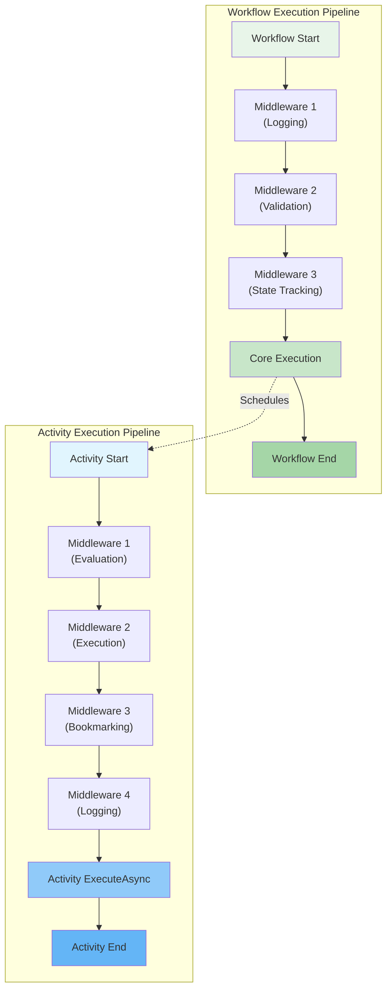

**Description**: Two-tier pipeline architecture. Workflow pipeline manages workflow execution; activity pipeline manages individual activity execution.

**Customization**: Add custom middleware via features:
```csharp
feature.WithWorkflowExecutionPipeline(pipeline =>
    pipeline.UseMiddleware<MyWorkflowMiddleware>());

feature.WithActivityExecutionPipeline(pipeline =>
    pipeline.UseMiddleware<MyActivityMiddleware>());
```

**Location**:
- `src/modules/Elsa.Workflows.Core/Pipelines/WorkflowExecution/`
- `src/modules/Elsa.Workflows.Core/Pipelines/ActivityExecution/`

---

### Feature Registration System

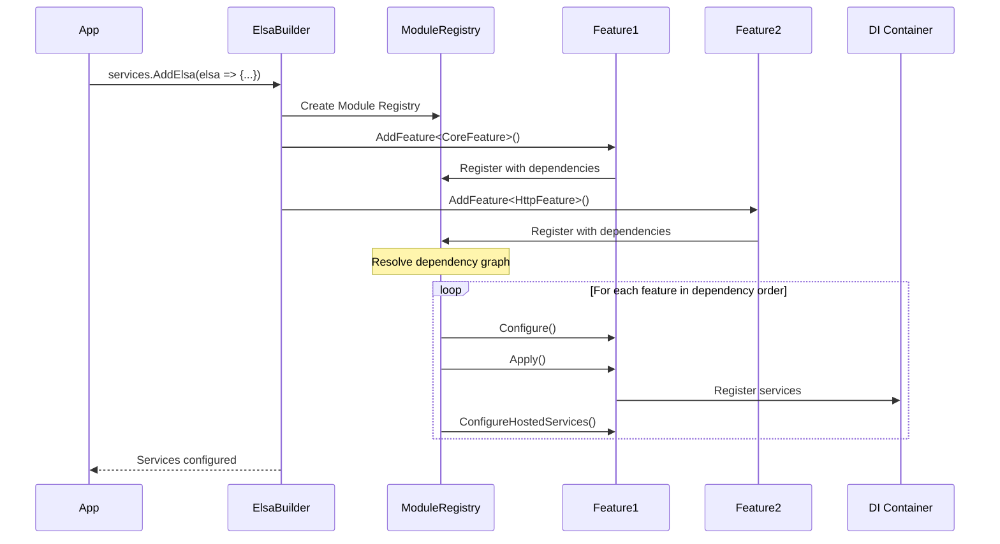

**Description**: Feature registration flow with dependency resolution and ordered application.

**Feature Lifecycle**:
1. **Register**: Features added via `AddFeature<T>()`
2. **Resolve**: Dependency graph computed
3. **Configure**: `Configure()` called (set up options)
4. **Apply**: `Apply()` called (register services)
5. **Hosted Services**: `ConfigureHostedServices()` called

**Location**: `src/common/Elsa.Features/Services/`

---

### Store Architecture

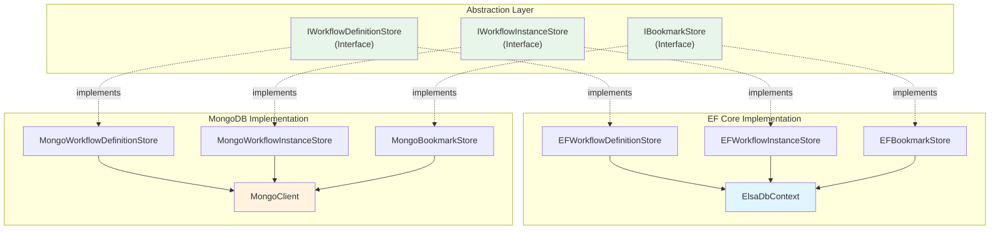

**Description**: Store abstraction pattern with multiple implementations. Consumers depend on interfaces, not implementations.

**Adding New Provider**:
1. Implement store interfaces
2. Create feature to register implementations
3. Add to appropriate module (e.g., `Elsa.Dapper`)

**Location**: `src/modules/Elsa.EntityFrameworkCore.*` and `src/modules/Elsa.MongoDb/`

---

### Expression Handler Architecture

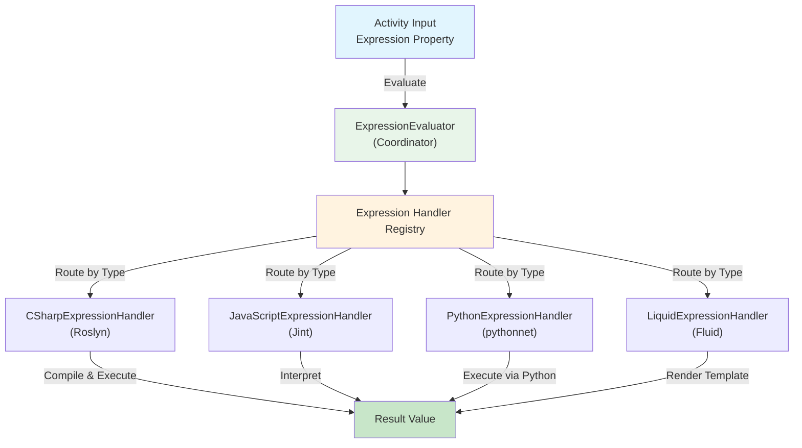

**Description**: Expression evaluation routing. `ExpressionEvaluator` dispatches to appropriate handler based on expression type.

**Adding Custom Handler**:
```csharp
public class MyExpressionHandler : IExpressionHandler
{
    public async ValueTask<object?> EvaluateAsync(
        Expression expression,
        Type returnType,
        ExpressionExecutionContext context,
        ExpressionEvaluatorOptions options)
    {
        // Custom evaluation logic
    }
}

// Register
services.AddExpressionHandler<MyExpressionHandler>("mylang");
```

**Location**: `src/modules/Elsa.Expressions/Services/ExpressionEvaluator.cs`

---

### Activity Registration Flow

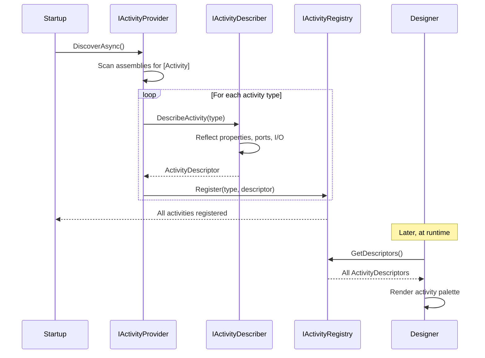

**Description**: Activity discovery and registration process. Activities are scanned, described, and registered at startup.

**Discovery Methods**:
- `AddActivitiesFrom<T>()` - Scan assembly containing T
- `AddActivity<T>()` - Register specific activity
- Custom `IActivityProvider` - Custom discovery logic

**Location**: `src/modules/Elsa.Workflows.Core/Services/`

---

### State Extraction and Materialization

```mermaid
graph LR
    subgraph "Extraction (Save)"
        WEC1["WorkflowExecutionContext<br/>(Runtime)"]
        Extractor["IWorkflowStateExtractor"]
        WS1["WorkflowState<br/>(Serializable)"]
        JSON1["JSON<br/>(Database)"]

        WEC1 -->|"Extract"| Extractor
        Extractor --> WS1
        WS1 -->|"Serialize"| JSON1
    end

    subgraph "Materialization (Load)"
        JSON2["JSON<br/>(Database)"]
        WS2["WorkflowState<br/>(Deserialized)"]
        Materializer["IWorkflowStateSerializer"]
        WEC2["WorkflowExecutionContext<br/>(Restored)"]

        JSON2 -->|"Deserialize"| WS2
        WS2 -->|"Materialize"| Materializer
        Materializer --> WEC2
    end

    JSON1 -.->|"Persisted"| JSON2

    style WEC1 fill:#e8f5e9
    style Extractor fill:#fff3e0
    style WS1 fill:#e1f5fe
    style JSON1 fill:#e0f2f1
    style JSON2 fill:#e0f2f1
    style WS2 fill:#e1f5fe
    style Materializer fill:#fff9c4
    style WEC2 fill:#c8e6c9
```

**Description**: Bidirectional process: extract runtime state to serializable form for persistence, then materialize back to runtime form.

**Key Services**:
- `IWorkflowStateExtractor` - Runtime → State
- `IWorkflowStateSerializer` - State ↔ JSON
- Stores - JSON ↔ Database

**Location**:
- `src/modules/Elsa.Workflows.Core/State/WorkflowStateExtractor.cs`
- `src/modules/Elsa.Workflows.Core/Serialization/`

---

### Middleware Pipeline Execution

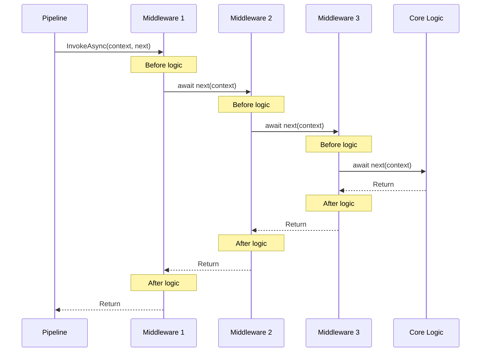

**Description**: Middleware execution order: each middleware wraps the next, forming an onion pattern. "Before" logic executes top-down, "after" logic executes bottom-up.

**Middleware Pattern**:
```csharp
public class MyMiddleware : IActivityExecutionMiddleware
{
    public async ValueTask InvokeAsync(
        ActivityExecutionContext context,
        ActivityMiddlewareDelegate next)
    {
        // Before
        Console.WriteLine("Before activity");

        await next(context);  // Call next middleware / core

        // After
        Console.WriteLine("After activity");
    }
}
```

**Location**: `src/modules/Elsa.Workflows.Core/Pipelines/`

---

### Dependency Injection Structure

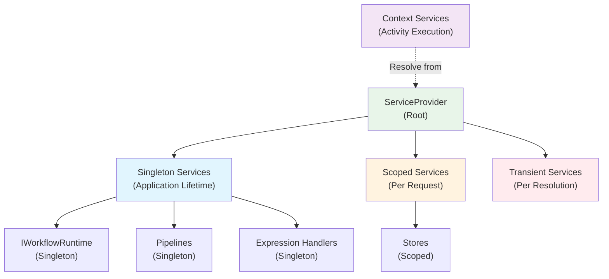

**Description**: DI service lifetimes in Elsa. Most services are singletons; stores are scoped; contexts resolve services on-demand.

**Common Lifetimes**:
- **Singleton**: Workflow runtime, pipelines, registries, handlers
- **Scoped**: Database contexts, stores (per request in web apps)
- **Transient**: Minimal use, per-resolution services

**Accessing Services**:
```csharp
// In activity
var myService = context.GetRequiredService<IMyService>();

// Via DI
public class MyActivity : CodeActivity
{
    private readonly IMyService _myService;

    public MyActivity(IMyService myService)
    {
        _myService = myService;
    }
}
```

---

### Build System Workflow

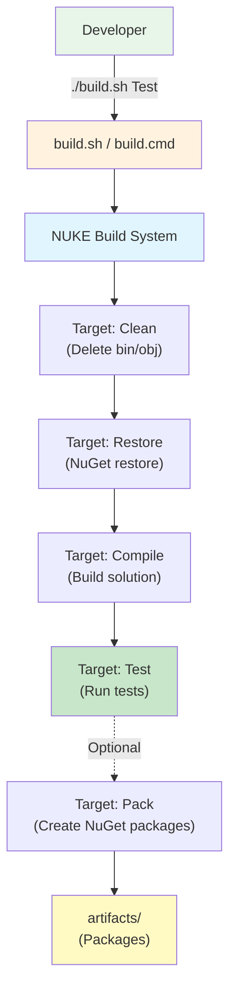

**Description**: NUKE-based build system workflow. Targets execute in dependency order.

**Common Commands**:
```bash
# Default (Compile)
./build.sh

# Clean and compile
./build.sh Clean Compile

# Run tests
./build.sh Test

# Create packages
./build.sh Pack

# Release with code coverage
./build.sh --configuration Release Test --analyse-code
```

**Configuration**: `build/Build.cs`

---

### Test Organization

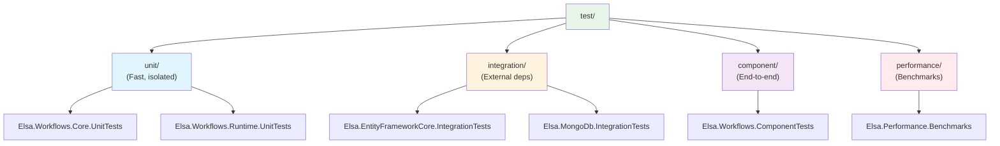

**Description**: Four-tier test organization. Tests are grouped by speed and isolation level.

**Test Types**:
- **Unit**: Fast, no I/O, isolated (mocks/stubs)
- **Integration**: Database, message queues, real dependencies
- **Component**: End-to-end workflows, full system tests
- **Performance**: BenchmarkDotNet performance tests

**Naming**: `[ProjectName].Tests` or `[ProjectName].UnitTests`

---

### Pull Request Workflow

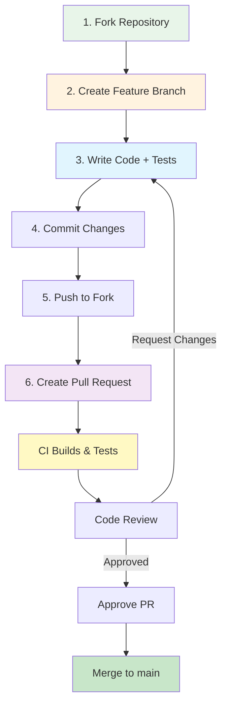

**Description**: Contribution workflow from fork to merge.

**Steps**:
1. Fork repository
2. Create feature branch (`feature/my-feature`)
3. Write code and tests
4. Commit with conventional commit message
5. Push to your fork
6. Create pull request
7. Address review feedback
8. Merge after approval

**Rules**:
- Open issue before major changes
- Write tests for new features
- Follow code style (`.editorconfig`)
- No `git rebase` - use merge commits
- Conventional commit messages

---

### Activity Descriptor Generation

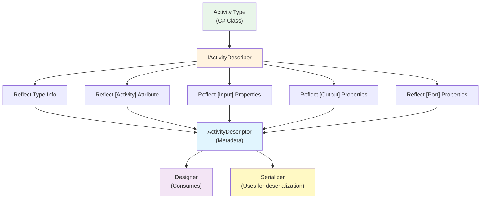

**Description**: Activity descriptor generation via reflection. Metadata extracted from activity class structure.

**Descriptor Contains**:
- Type name, version, category
- Display name, description
- Input/Output property metadata
- Port definitions
- Behavior configurations
- UI hints

**Location**: `src/modules/Elsa.Workflows.Core/Services/ActivityDescriber.cs`

---

### Bookmark Resolution Flow

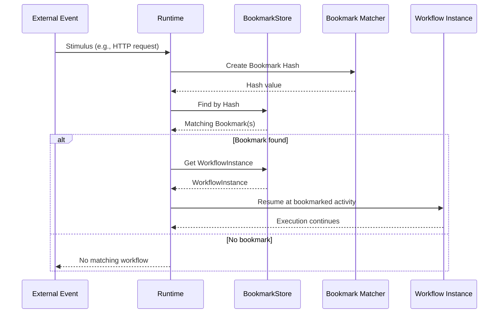

**Description**: Bookmark resolution process when external events arrive.

**Resolution Steps**:
1. External event creates stimulus
2. Stimulus converted to bookmark hash
3. Hash matched against stored bookmarks
4. Matching workflow instance loaded
5. Workflow resumed at bookmarked activity

**Hash Calculation**: Based on bookmark name + payload (deterministic)

**Location**: `src/modules/Elsa.Workflows.Runtime/Services/BookmarkManager.cs`

---

### Actor Model Integration

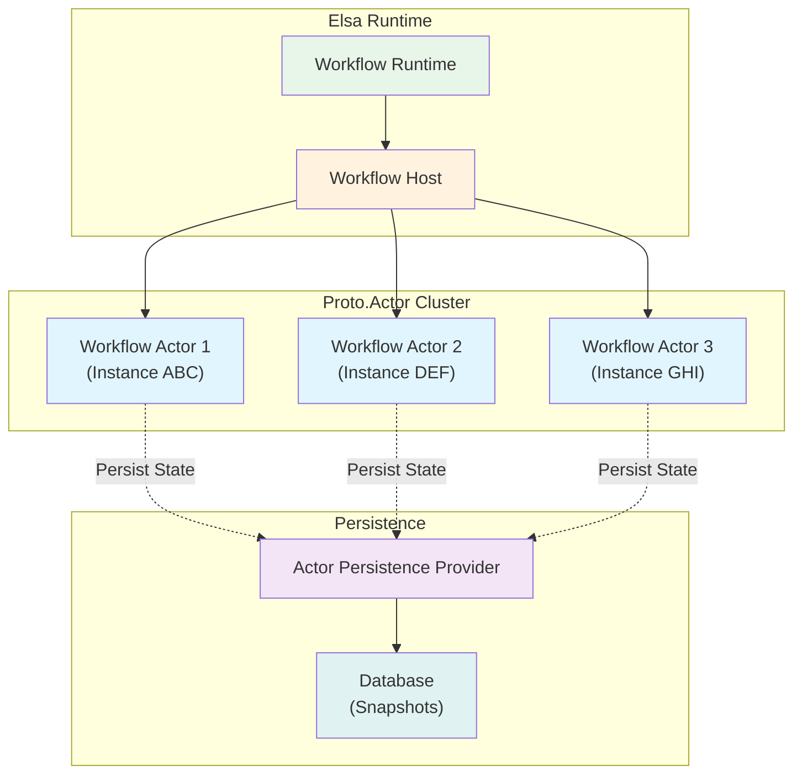

**Description**: Proto.Actor integration for distributed workflow execution. Each workflow instance is a virtual actor.

**Benefits**:
- **Location Transparency**: Workflows can run on any node
- **Scalability**: Distribute across cluster
- **Fault Tolerance**: Actor supervision and recovery
- **Isolation**: Each workflow instance is independent

**Configuration**:
```csharp
services.AddElsa(elsa =>
{
    elsa.UseWorkflowRuntime(runtime =>
    {
        runtime.UseProtoActor(proto =>
        {
            proto.PersistenceProvider = ...;
            proto.ClusterProvider = ...;
        });
    });
});
```

**Location**: `src/modules/Elsa.Workflows.Runtime.ProtoActor/`

---

### Persistence Provider Architecture

```mermaid
graph TB
    subgraph "Store Abstractions"
        IDefStore["IWorkflowDefinitionStore"]
        IInstStore["IWorkflowInstanceStore"]
        IBookmarkStore["IBookmarkStore"]
        ITriggerStore["ITriggerStore"]
    end

    subgraph "Provider Implementations"
        direction LR
        EFCore["Entity Framework Core<br/>(SQL: SQLite, PostgreSQL,<br/>SQL Server, MySQL, Oracle)"]
        Mongo["MongoDB<br/>(NoSQL)"]
        Dapper["Dapper<br/>(Lightweight SQL)"]
        Custom["Custom<br/>(Your implementation)"]
    end

    IDefStore -.->|implements| EFCore
    IInstStore -.->|implements| EFCore
    IBookmarkStore -.->|implements| EFCore
    ITriggerStore -.->|implements| EFCore

    IDefStore -.->|implements| Mongo
    IInstStore -.->|implements| Mongo
    IBookmarkStore -.->|implements| Mongo
    ITriggerStore -.->|implements| Mongo

    IDefStore -.->|implements| Dapper
    IInstStore -.->|implements| Dapper

    IDefStore -.->|implements| Custom
    IInstStore -.->|implements| Custom

    style IDefStore fill:#e8f5e9
    style IInstStore fill:#e8f5e9
    style IBookmarkStore fill:#e8f5e9
    style ITriggerStore fill:#e8f5e9
    style EFCore fill:#e1f5fe
    style Mongo fill:#fff3e0
    style Dapper fill:#f3e5f5
    style Custom fill:#ffebee
```

**Description**: Pluggable persistence architecture. Multiple providers available; choose based on requirements.

**Provider Comparison**:
- **EF Core**: Full-featured, multiple SQL databases, migrations
- **MongoDB**: NoSQL, schemaless, horizontal scaling
- **Dapper**: Lightweight, performance-focused, SQL only
- **Custom**: Implement interfaces for custom storage

**Adding Provider**:
1. Implement store interfaces
2. Create feature to register stores
3. Package as NuGet package
4. Document configuration

---

### CQRS/Mediator Pattern

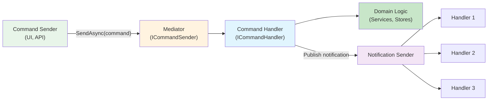

**Description**: CQRS pattern via mediator. Commands have single handler; notifications have multiple handlers.

**Usage**:
```csharp
// Send command
var result = await _commandSender.SendAsync(
    new SaveWorkflowDefinitionCommand
    {
        Definition = definition
    },
    cancellationToken);

// Publish notification
await _notificationSender.SendAsync(
    new WorkflowDefinitionSaved
    {
        WorkflowDefinition = definition
    },
    cancellationToken);
```

**Benefits**:
- Decoupled modules
- Single responsibility
- Easy to add cross-cutting concerns
- Testable handlers

**Location**: `src/common/Elsa.Mediator/`

---

### Workflow Materialization

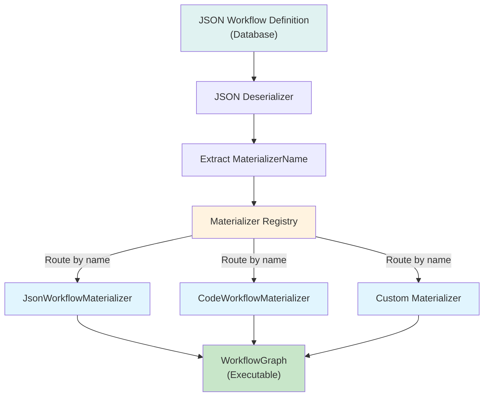

**Description**: Workflow materialization process. Different materializers handle different workflow definition formats.

**Materializer Types**:
- **JsonWorkflowMaterializer**: JSON-defined workflows (from designer)
- **CodeWorkflowMaterializer**: C#-coded workflows
- **Custom**: Implement `IWorkflowMaterializer` for custom formats

**Process**:
1. Load JSON from database
2. Extract `MaterializerName` property
3. Route to appropriate materializer
4. Materializer creates `WorkflowGraph`
5. Graph ready for execution

**Location**: `src/modules/Elsa.Workflows.Management/Materializers/`

---

## Cross-References

### Architecture Document Sections

For detailed explanations, see the [Brownfield Architecture Document](./architecture.md):

- **Activity Model**: [Core Abstractions - Activity Model](./architecture.md#activity-model)
- **Execution Contexts**: [Core Abstractions - Execution Contexts](./architecture.md#execution-contexts)
- **Pipeline Architecture**: [Core Abstractions - Pipeline Architecture](./architecture.md#pipeline-architecture)
- **State Management**: [Data Models and State Management](./architecture.md#data-models-and-state-management)
- **Persistence Layer**: [Persistence Layer](./architecture.md#persistence-layer)
- **Expression System**: [Expression System](./architecture.md#expression-system)
- **Feature System**: [Module/Feature System](./architecture.md#modulefeature-system)
- **Runtime Services**: [Runtime Services](./architecture.md#runtime-services)
- **Extension Points**: [Extension Points](./architecture.md#extension-points)
- **Build Process**: [Development and Build Process](./architecture.md#development-and-build-process)
- **Testing**: [Testing Infrastructure](./architecture.md#testing-infrastructure)
- **Contributing**: [Contributing Guidelines](./architecture.md#contributing-guidelines)

---

## Quick Reference Card

### Creating a Custom Feature

```csharp
[DependsOn(typeof(WorkflowsCoreFeature))]
public class MyFeature : FeatureBase
{
    public MyFeature(IModule module) : base(module) { }

    public override void Configure()
    {
        // Configure options
        Module.Configure<MyOptions>(options =>
        {
            options.Setting = "value";
        });
    }

    public override void Apply()
    {
        // Register services
        Services.AddSingleton<IMyService, MyService>();
        Services.AddActivity<MyActivity>();

        // Add middleware
        Module.WithActivityExecutionPipeline(pipeline =>
            pipeline.UseMiddleware<MyMiddleware>());
    }

    public override void ConfigureHostedServices()
    {
        // Register background services
        ConfigureHostedService<MyBackgroundService>();
    }
}
```

### Implementing a Custom Store

```csharp
public class MyWorkflowInstanceStore : IWorkflowInstanceStore
{
    public async ValueTask<WorkflowInstance?> FindAsync(
        WorkflowInstanceFilter filter,
        CancellationToken cancellationToken = default)
    {
        // Your custom query logic
        // Use filter properties to build query
        // Return matching WorkflowInstance or null
    }

    public async ValueTask SaveAsync(
        WorkflowInstance instance,
        CancellationToken cancellationToken = default)
    {
        // Your custom save logic
        // Insert or update instance
    }

    // Implement other interface methods...
}

// Register in feature
Services.AddScoped<IWorkflowInstanceStore, MyWorkflowInstanceStore>();
```

### Creating Custom Middleware

```csharp
public class LoggingMiddleware : IActivityExecutionMiddleware
{
    private readonly ILogger<LoggingMiddleware> _logger;

    public LoggingMiddleware(ILogger<LoggingMiddleware> logger)
    {
        _logger = logger;
    }

    public async ValueTask InvokeAsync(
        ActivityExecutionContext context,
        ActivityMiddlewareDelegate next)
    {
        var activityType = context.Activity.Type;
        _logger.LogInformation("Executing: {ActivityType}", activityType);

        var sw = Stopwatch.StartNew();
        await next(context);
        sw.Stop();

        _logger.LogInformation(
            "Completed: {ActivityType} in {Duration}ms",
            activityType,
            sw.ElapsedMilliseconds);
    }
}

// Register in feature
Module.WithActivityExecutionPipeline(pipeline =>
    pipeline.UseMiddleware<LoggingMiddleware>());
```

### Sending Commands/Notifications

```csharp
// Inject mediator services
private readonly ICommandSender _commandSender;
private readonly INotificationSender _notificationSender;

// Send command (single handler)
var result = await _commandSender.SendAsync(
    new SaveWorkflowDefinitionCommand
    {
        Definition = workflowDefinition
    },
    cancellationToken);

// Publish notification (multiple handlers)
await _notificationSender.SendAsync(
    new WorkflowDefinitionSaved
    {
        WorkflowDefinition = result
    },
    cancellationToken);
```

### Querying Stores

```csharp
// Inject store
private readonly IWorkflowInstanceStore _store;

// Create filter
var filter = new WorkflowInstanceFilter
{
    DefinitionId = "my-workflow",
    Status = WorkflowStatus.Running,
    CorrelationId = "ORD-123"
};

// Query
var instances = await _store.FindManyAsync(filter, cancellationToken);

// Paginated query
var pageArgs = new PageArgs { Page = 1, PageSize = 10 };
var page = await _store.FindManyAsync(filter, pageArgs, cancellationToken);
```

---

**Document Version**: 1.0
**Last Updated**: 2025-11-11
**For**: Elsa Workflows v3 Contributors
