# Elsa Workflows - User Glossary

**Audience**: Developers building workflows with Elsa
**Purpose**: Quick reference for terms, entities, and concepts when using Elsa
**Companion Document**: See [Brownfield Architecture Document](./architecture.md) for detailed explanations

---

## Table of Contents

- [Core Terms](#core-terms)
- [Domain Entities](#domain-entities)
- [Visual Guides](#visual-guides)
  - [System Overview](#system-overview)
  - [Workflow Lifecycle](#workflow-lifecycle)
  - [Activity Execution](#activity-execution)
  - [Long-Running Workflows](#long-running-workflows)
  - [Expression System](#expression-system)
  - [Variable Scoping](#variable-scoping)
  - [HTTP Workflows](#http-workflows)
  - [Composite Activities](#composite-activities)
  - [Error Handling](#error-handling)
  - [Workflow Versioning](#workflow-versioning)
  - [Triggers and Events](#triggers-and-events)
  - [Workflow Correlation](#workflow-correlation)
  - [Activity Ports](#activity-ports)
  - [State Persistence](#state-persistence)
  - [Workflow Cancellation](#workflow-cancellation)
- [Cross-References](#cross-references)

---

## Core Terms

### Activity
A single unit of work in a workflow. Activities are the building blocks that perform operations like sending HTTP requests, writing to logs, performing calculations, or making decisions.

**Example**: `SendHttpRequest`, `WriteLine`, `SetVariable`, `If`

**See**: [Architecture Doc - Activity Model](./architecture.md#activity-model)

---

### Activity Node
The representation of an activity within a workflow graph. Each activity instance becomes a node with a unique `NodeId` in the workflow structure.

**Properties**:
- `NodeId` - Unique identifier within workflow graph
- `Activity` - The actual activity instance
- Connections to other nodes

---

### Bookmark
A resumption point in a workflow that allows it to pause and wait for an external event. When the event occurs, the workflow resumes from the bookmarked activity.

**Use Cases**:
- Waiting for HTTP requests (webhooks)
- Waiting for user input
- Waiting for message queue events
- Waiting for scheduled time

**Example**: An `HttpEndpoint` activity creates a bookmark, suspending the workflow until an HTTP request arrives.

**See**: [Architecture Doc - Bookmark System](./architecture.md#bookmark-system)

---

### Code Activity
A C# class that implements workflow logic. The recommended way to create custom activities by inheriting from `CodeActivity` or `CodeActivity<T>`.

**Example**:
```csharp
[Activity("MyNamespace", "MyCategory", "Fetches user data")]
public class FetchUserActivity : CodeActivity<User>
{
    [Input] public Input<string> UserId { get; set; }

    protected override async ValueTask ExecuteAsync(ActivityExecutionContext context)
    {
        var userId = UserId.Get(context);
        var user = await _userService.GetUserAsync(userId);
        context.SetResult(user);
    }
}
```

**See**: [Architecture Doc - Creating Custom Activities](./architecture.md#creating-custom-activities)

---

### Composite Activity
An activity that contains other activities (children). Examples include `Sequence`, `Flowchart`, `ForEach`, `While`, and `Parallel`.

**Use**: Organize complex workflows into logical units, create reusable workflow components.

---

### Correlation
A mechanism to match incoming events (like HTTP requests or messages) with the correct workflow instance. Uses a `CorrelationId` to identify related workflow executions.

**Example**: Order processing workflow where all events for order "ORD-123" are correlated using that order ID.

---

### Expression
A dynamic value that is evaluated at runtime. Elsa supports multiple expression languages:
- **C#**: `new CSharpExpression("input.Name.ToUpper()")`
- **JavaScript**: `new JavaScriptExpression("input.name.toUpperCase()")`
- **Python**: `new PythonExpression("input['name'].upper()")`
- **Liquid**: `new LiquidExpression("{{ input.name | upcase }}")`

**See**: [Architecture Doc - Expression System](./architecture.md#expression-system)

---

### Flowchart
A composite activity that executes child activities based on connections and conditions. Supports branching, looping, and parallel execution paths.

**Use**: Visual workflows, complex branching logic, decision trees.

---

### Input
A property on an activity that accepts a value from the workflow. Decorated with `[Input]` attribute. Can accept literal values or expressions.

**Example**:
```csharp
[Input(Description = "The URL to send request to")]
public Input<string> Url { get; set; }
```

---

### Long-Running Workflow
A workflow that can pause execution and resume later, typically using bookmarks. Unlike short-running workflows that complete immediately, long-running workflows can span hours, days, or weeks.

**Examples**:
- Order fulfillment (wait for payment, shipping, delivery)
- Approval processes (wait for manager approval)
- Scheduled tasks (wait until specific time)

**See**: [Architecture Doc - Long-Running Workflows](./architecture.md#long-running-workflows)

---

### Outcome
A named exit point from an activity. Activities can have multiple outcomes representing different execution paths (e.g., "Done", "True", "False", "Success", "Failed").

**Example**: An `If` activity has two outcomes: "True" and "False"

---

### Output
A property on an activity that produces a value. Decorated with `[Output]` attribute. Other activities can reference this output as input.

**Example**:
```csharp
[Output(Description = "The HTTP response")]
public Output<HttpResponseMessage> Response { get; set; }
```

---

### Port
A connection point on an activity that can be linked to another activity. Represented by activity properties decorated with `[Port]` attribute.

**Example**:
```csharp
[Port]
public IActivity? Then { get; set; }  // Next activity to execute
```

---

### Sequence
A composite activity that executes child activities in order, one after another. Simplest form of activity composition.

**Use**: Linear workflows, step-by-step processes.

---

### Trigger
An activity that starts a workflow automatically when an event occurs. Common triggers include:
- **HttpEndpoint**: Starts on HTTP request
- **Timer**: Starts on schedule (cron expression)
- **MessageReceived**: Starts on message queue event

**See**: [Architecture Doc - Trigger System](./architecture.md#trigger-system)

---

### Variable
A named storage location for workflow data. Variables are scoped to their containing activity (typically `Sequence` or `Flowchart`).

**Example**:
```csharp
var sequence = new Sequence
{
    Variables = { new Variable<string>("userName") },
    Activities = { /* activities that use userName */ }
};
```

---

### Workflow
A graph of connected activities that performs business logic. Can be defined in code, JSON, or visually through the designer.

**Types**:
- **Short-Running**: Completes immediately
- **Long-Running**: Can pause and resume
- **Singleton**: Only one instance can run at a time
- **Burst**: Multiple instances can run simultaneously

---

### Workflow Definition
The blueprint or template for a workflow. Contains the structure (activities, connections) but not execution state.

**Properties**:
- `DefinitionId` - Unique identifier for this workflow
- `Version` - Version number
- `IsLatest` - Whether this is the latest version
- `IsPublished` - Whether this version is published

---

### Workflow Instance
A running or completed execution of a workflow definition. Contains execution state, variables, bookmarks, and history.

**Properties**:
- `Id` - Unique instance identifier
- `DefinitionId` - Which definition this is an instance of
- `DefinitionVersion` - Which version was used
- `Status` - Current status (Running, Suspended, Finished, Faulted)
- `CorrelationId` - Optional correlation identifier

---

### Workflow Status
The execution state of a workflow instance:
- **Pending**: Created but not yet started
- **Running**: Currently executing
- **Suspended**: Paused, waiting for external event (bookmark)
- **Finished**: Completed successfully
- **Faulted**: Terminated due to error
- **Canceled**: Manually canceled

---

## Domain Entities

### Activity Entity

**Purpose**: Represents a single unit of work in a workflow

**Key Properties**:
- `Id` (string) - Unique within activity collection
- `NodeId` (string) - Unique within workflow graph
- `Name` (string?) - Optional friendly name
- `Type` (string) - Activity type identifier
- `Version` (int) - Activity version

**Key Methods**:
- `CanExecuteAsync()` - Check if activity can execute
- `ExecuteAsync()` - Execute the activity logic

**Relationships**:
- Contains: Input properties, Output properties
- Part of: Workflow graph
- Executed by: Activity execution pipeline

---

### Workflow Entity

**Purpose**: Container for workflow structure and execution

**Key Properties**:
- `Root` (IActivity) - Root activity of the workflow
- `Variables` (IEnumerable<Variable>) - Workflow-level variables
- `CustomProperties` (IDictionary) - Metadata

**Types**:
- Programmatic (C# code)
- JSON-defined
- Designer-created

**Lifecycle**: Definition → Instance → Execution → Completion/Suspension

---

### WorkflowDefinition Entity

**Purpose**: Persistent blueprint for workflows

**Key Properties**:
- `DefinitionId` (string) - Unique identifier
- `Version` (int) - Version number
- `IsLatest` (bool) - Latest version flag
- `IsPublished` (bool) - Published status
- `Name` (string?) - Display name
- `Description` (string?) - Description
- `CreatedAt` (DateTimeOffset) - Creation timestamp
- `MaterializerName` (string) - How to deserialize

**Storage**: Persisted via `IWorkflowDefinitionStore`

---

### WorkflowInstance Entity

**Purpose**: Represents a running or completed workflow execution

**Key Properties**:
- `Id` (string) - Unique instance identifier
- `DefinitionId` (string) - Which definition
- `DefinitionVersion` (int) - Which version
- `Status` (WorkflowStatus) - Current status
- `SubStatus` (WorkflowSubStatus) - Detailed status
- `CorrelationId` (string?) - For event correlation
- `CreatedAt` (DateTimeOffset) - Start time
- `FinishedAt` (DateTimeOffset?) - End time
- `WorkflowState` (WorkflowState) - Serialized state

**Storage**: Persisted via `IWorkflowInstanceStore`

---

### Bookmark Entity

**Purpose**: Resumption point for suspended workflows

**Key Properties**:
- `Id` (string) - Unique bookmark identifier
- `Name` (string) - Bookmark type/name
- `Hash` (string) - For matching with events
- `Payload` (object?) - Activity-specific data
- `ActivityNodeId` (string) - Which activity created it
- `CorrelationId` (string?) - For correlation

**Lifecycle**:
1. Activity creates bookmark
2. Workflow suspends
3. External event matches bookmark hash
4. Workflow resumes at bookmarked activity

---

### Input<T> Entity

**Purpose**: Activity input property wrapper

**Properties**:
- `MemoryBlockReference` - Where value is stored
- `Expression` - Dynamic expression for value

**Methods**:
- `Get(context)` - Retrieve value with evaluation
- `Set(value)` - Set literal value

**Example**:
```csharp
[Input]
public Input<string> Message { get; set; } = new("Hello");

// In activity:
var message = Message.Get(context);
```

---

### Output<T> Entity

**Purpose**: Activity output property wrapper

**Properties**:
- `MemoryBlockReference` - Where to store value

**Methods**:
- `Set(context, value)` - Set output value

**Example**:
```csharp
[Output]
public Output<HttpResponse> Response { get; set; }

// In activity:
Response.Set(context, httpResponse);
```

---

### Variable Entity

**Purpose**: Named storage for workflow data

**Key Properties**:
- `Id` (string) - Unique identifier
- `Name` (string?) - Variable name
- `Value` (object?) - Current value
- `StorageDriverType` (Type?) - How to persist

**Scoping**: Variables are scoped to their container (Sequence, Flowchart, Workflow)

**Access**:
```csharp
// Set variable
context.SetVariable("userName", "John");

// Get variable
var userName = context.GetVariable<string>("userName");

// In expressions
new CSharpExpression("userName.ToUpper()")
```

---

### Expression Entity

**Purpose**: Dynamic value evaluated at runtime

**Properties**:
- `Type` (string) - Expression language (C#, JavaScript, Python, Liquid)
- `Value` (object) - Expression string/object

**Languages**:
- **C#**: Full C# scripting via Roslyn
- **JavaScript**: ECMAScript via Jint engine
- **Python**: Python via pythonnet
- **Liquid**: Template engine via Fluid

**Example**:
```csharp
var expr = new CSharpExpression("input.Name + \" \" + input.LastName");
```

---

### Trigger Entity

**Purpose**: Automatically starts workflows on events

**Common Trigger Activities**:
- `HttpEndpoint` - HTTP request arrives
- `Timer` - Scheduled time/cron
- `MessageReceived` - Message queue event

**Mechanism**:
1. Trigger indexer discovers triggers in workflows
2. Runtime registers triggers
3. Events match triggers to workflow definitions
4. New workflow instances start automatically

---

### Connection Entity

**Purpose**: Links activities in a flowchart

**Properties**:
- `Source` (Endpoint) - Source activity and port
- `Target` (Endpoint) - Target activity and port

**Example**: Connect activity A's "Done" outcome to activity B

---

## Visual Guides

### System Overview

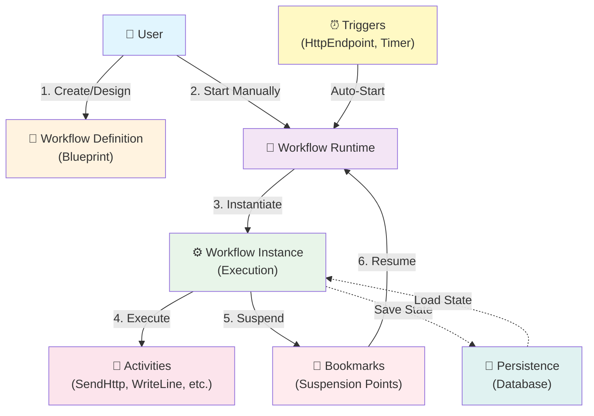

**Description**: High-level overview of how users interact with Elsa workflows, from definition to execution.

---

### Workflow Lifecycle

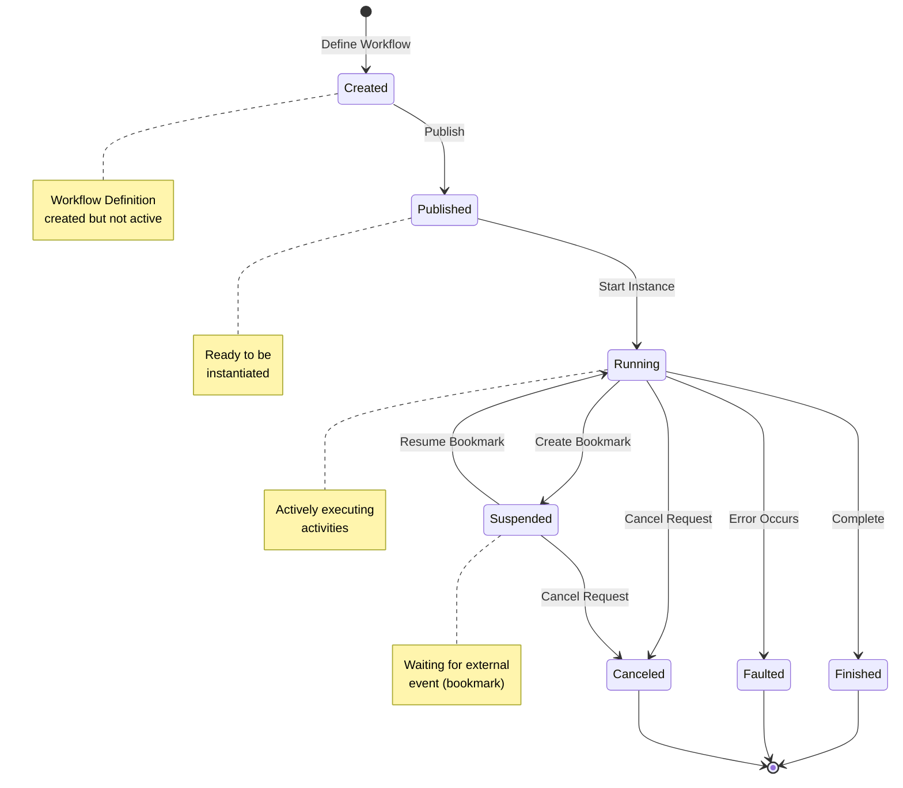

**Description**: Complete lifecycle of a workflow from definition to completion, including suspension for long-running scenarios.

---

### Activity Execution

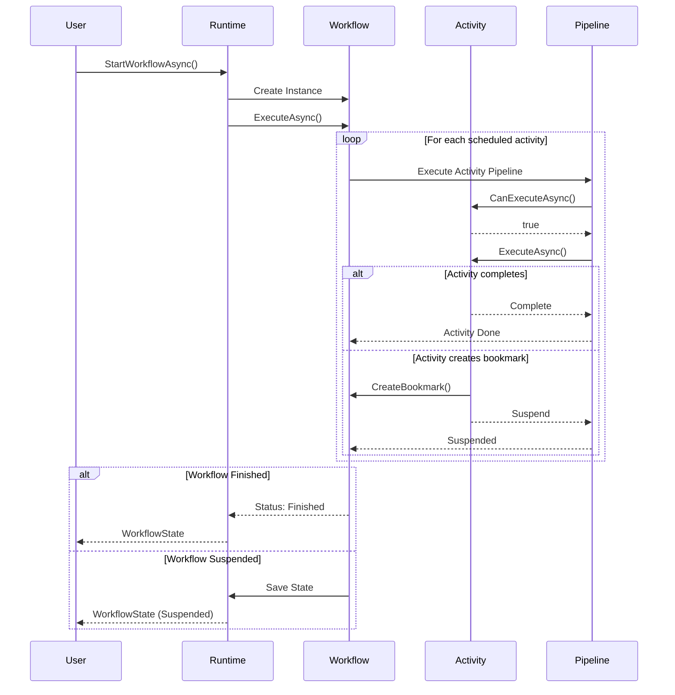

**Description**: Sequence of events when executing activities in a workflow, showing completion and suspension paths.

---

### Long-Running Workflows

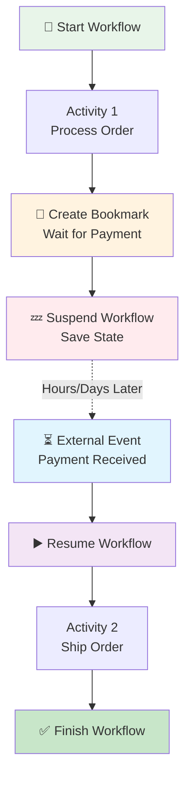

**Description**: How workflows pause with bookmarks and resume when external events occur.

**Use Cases**:
- Order fulfillment (wait for payment)
- Approval workflows (wait for manager)
- Scheduled tasks (wait until time)
- Webhook handlers (wait for callback)

---

### Expression System

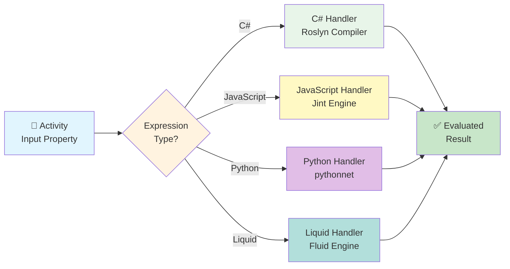

**Description**: How expressions are evaluated at runtime using different language handlers.

**Example Usage**:
```csharp
// C# Expression
new Input<string>(new CSharpExpression("input.Name.ToUpper()"))

// JavaScript Expression
new Input<string>(new JavaScriptExpression("input.name.toUpperCase()"))

// Python Expression
new Input<string>(new PythonExpression("input['name'].upper()"))

// Liquid Expression
new Input<string>(new LiquidExpression("{{ input.name | upcase }}"))
```

---

### Variable Scoping

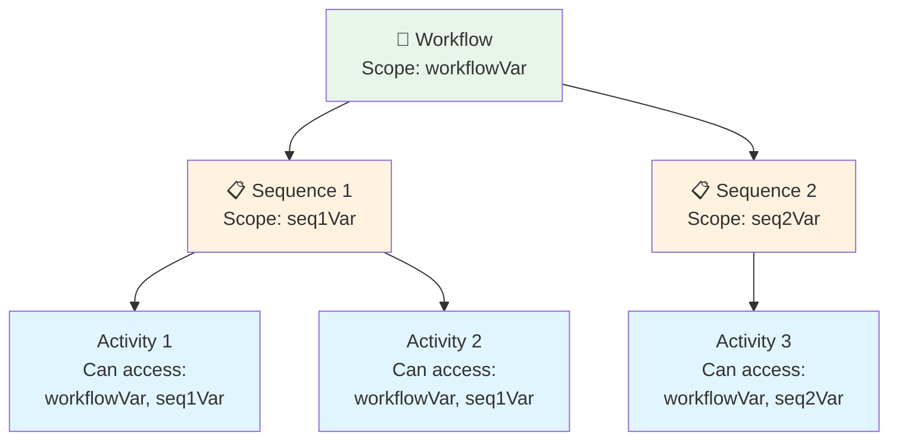

**Description**: Variables are scoped hierarchically. Child activities can access parent variables, but not sibling variables.

**Example**:
```csharp
var workflow = new Workflow
{
    Variables = { new Variable<string>("workflowVar") },
    Root = new Sequence
    {
        Variables = { new Variable<int>("seqVar") },
        Activities =
        {
            // Can access both workflowVar and seqVar
            new WriteLine { Text = new(ctx => ctx.GetVariable<string>("workflowVar")) },
            new WriteLine { Text = new(ctx => ctx.GetVariable<int>("seqVar").ToString()) }
        }
    }
};
```

---

### HTTP Workflows

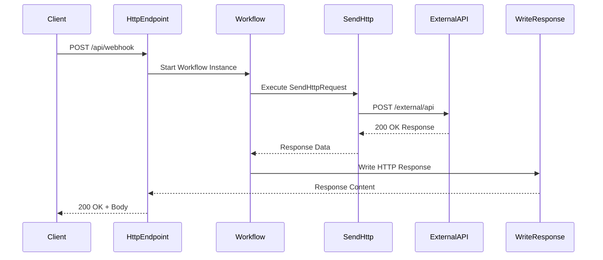

**Description**: Typical HTTP workflow pattern: receive request, process, call external API, return response.

**Example Workflow**:
```csharp
var workflow = new WorkflowBuilder()
    .WithHttpEndpoint("/api/process", HttpMethods.Post)
    .Then<ParseJsonActivity>()
    .Then<SendHttpRequest>(req =>
    {
        req.Url = new("https://api.external.com/data");
        req.Method = new(HttpMethods.Post);
    })
    .Then<WriteHttpResponse>(resp =>
    {
        resp.Content = new("Processed successfully");
    })
    .Build();
```

---

### Composite Activities

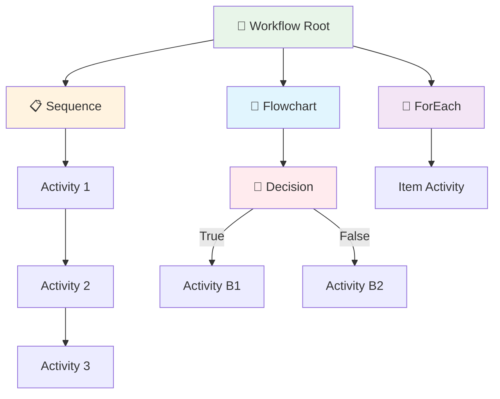

**Description**: Composite activities contain other activities. Common types: Sequence (linear), Flowchart (branching), ForEach (iteration).

**Usage**:
- **Sequence**: Execute activities in order
- **Flowchart**: Complex branching logic, loops
- **ForEach**: Process collection of items
- **Parallel**: Execute activities simultaneously
- **While**: Loop while condition is true

---

### Error Handling

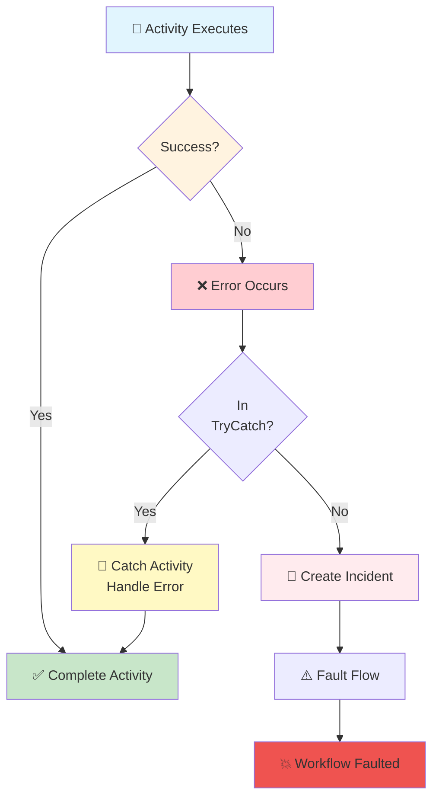

**Description**: Error handling flow in workflows, with optional TryCatch activities for graceful error recovery.

**Example**:
```csharp
new TryCatch
{
    Try = new SendHttpRequest { Url = new("https://api.example.com") },
    Catches =
    {
        new Catch<HttpRequestException>
        {
            Activity = new WriteLine { Text = new("HTTP request failed") }
        }
    }
}
```

---

### Workflow Versioning

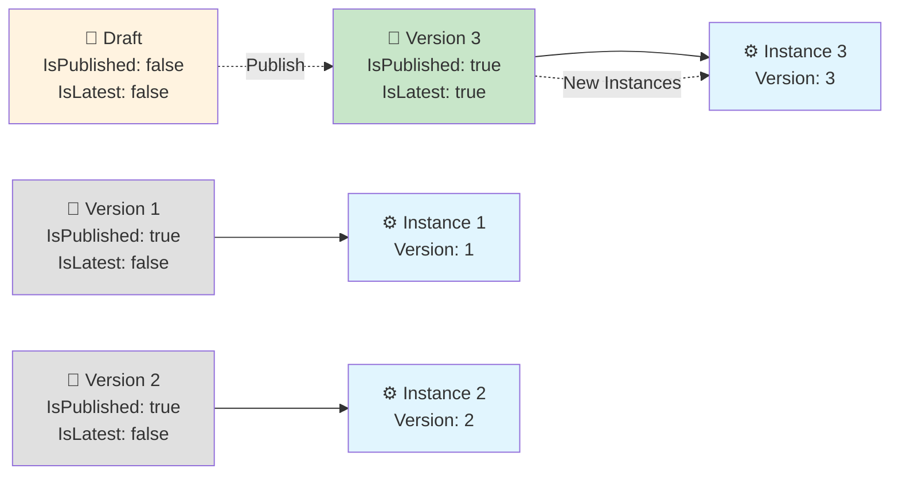

**Description**: Multiple versions of a workflow definition can coexist. Running instances use their original version.

**Key Points**:
- Each version is immutable
- `IsLatest` flag marks newest version
- `IsPublished` controls availability
- Running instances don't auto-upgrade
- Draft versions can be edited

---

### Triggers and Events

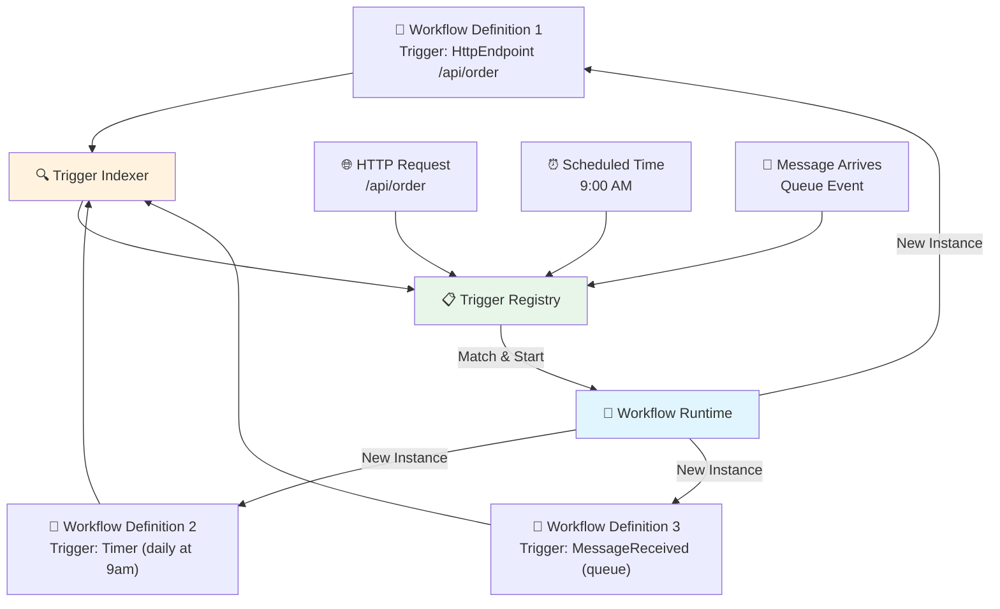

**Description**: How triggers automatically start workflow instances when events occur.

**Trigger Types**:
- **HttpEndpoint**: HTTP requests
- **Timer**: Scheduled/cron-based
- **MessageReceived**: Message queue events
- **Custom**: Implement `IBookmarkHandler`

---

### Workflow Correlation

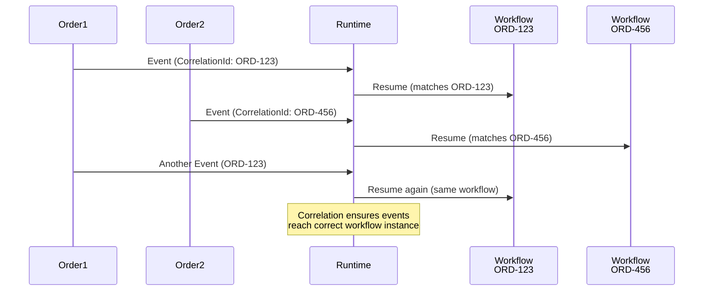

**Description**: Correlation matches events with the correct workflow instance using CorrelationId.

**Use Cases**:
- Order processing (all events for order ABC go to same workflow)
- User workflows (all events for user 123 go to same workflow)
- Multi-step processes (link related events together)

**Example**:
```csharp
// Start workflow with correlation
await runtime.StartWorkflowAsync(
    "order-workflow",
    new StartWorkflowRuntimeParams
    {
        CorrelationId = "ORD-123",
        Input = new { orderId = "ORD-123" }
    });

// Later, resume with same correlation
await runtime.ResumeBookmarkAsync(
    bookmarkId,
    new ResumeBookmarkOptions
    {
        CorrelationId = "ORD-123"
    });
```

---

### Activity Ports

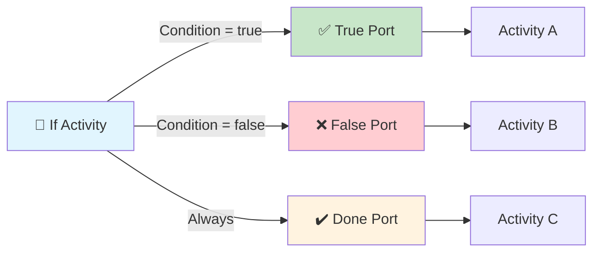

**Description**: Activities can have multiple ports (exit points) for different execution paths.

**Common Ports**:
- **Done**: Default completion port
- **True/False**: Conditional activities
- **Success/Failed**: Error handling
- **Custom**: Activity-specific outcomes

**Example**:
```csharp
var ifActivity = new If
{
    Condition = new(ctx => ctx.GetVariable<int>("age") >= 18),
    Then = new WriteLine { Text = new("Adult") },
    Else = new WriteLine { Text = new("Minor") }
};
```

---

### State Persistence

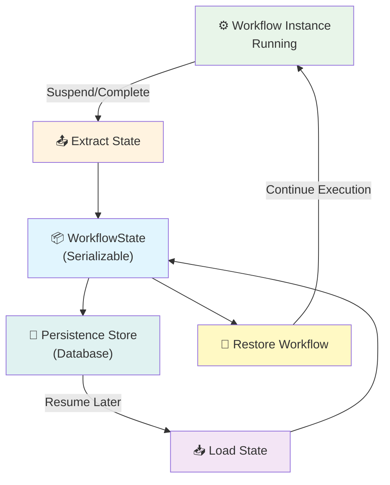

**Description**: How workflow state is persisted and restored for long-running workflows.

**WorkflowState Contains**:
- Workflow status and metadata
- Activity execution contexts (call stack)
- Scheduled activities
- Bookmarks
- Variables and properties
- Incidents (errors)

**Persistence Providers**:
- Entity Framework Core (SQL)
- MongoDB (NoSQL)
- Dapper (lightweight SQL)
- Custom (implement `IWorkflowInstanceStore`)

---

### Workflow Cancellation

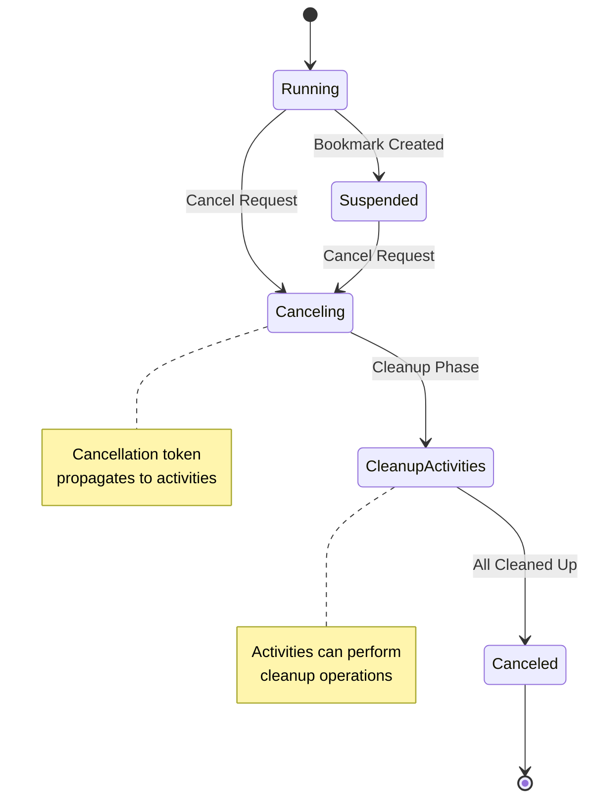

**Description**: Workflow cancellation flow, allowing graceful cleanup before termination.

**Cancellation Methods**:
```csharp
// Cancel via runtime
await runtime.CancelWorkflowAsync(workflowInstanceId);

// Check cancellation in activity
protected override async ValueTask ExecuteAsync(ActivityExecutionContext context)
{
    if (context.CancellationToken.IsCancellationRequested)
    {
        // Cleanup and exit
        return;
    }

    // Normal execution
}
```

---

## Cross-References

### Architecture Document Sections

For detailed explanations, see the [Brownfield Architecture Document](./architecture.md):

- **Activity Model**: [Core Abstractions - Activity Model](./architecture.md#activity-model)
- **Execution Contexts**: [Core Abstractions - Execution Contexts](./architecture.md#execution-contexts)
- **Bookmark System**: [Runtime Services - Bookmark System](./architecture.md#bookmark-system)
- **Trigger System**: [Runtime Services - Trigger System](./architecture.md#trigger-system)
- **Expression System**: [Expression System](./architecture.md#expression-system)
- **Persistence Layer**: [Persistence Layer](./architecture.md#persistence-layer)
- **Custom Activities**: [Extension Points - Creating Custom Activities](./architecture.md#creating-custom-activities)
- **Embedding Elsa**: [Embedding Elsa in Applications](./architecture.md#embedding-elsa-in-applications)

---

## Quick Reference Card

### Common Workflow Patterns

**Simple Sequential Workflow**:
```csharp
var workflow = new Sequence
{
    Activities =
    {
        new WriteLine { Text = new("Step 1") },
        new WriteLine { Text = new("Step 2") },
        new WriteLine { Text = new("Step 3") }
    }
};
```

**Conditional Workflow**:
```csharp
var workflow = new If
{
    Condition = new(ctx => ctx.GetInput<int>("age") >= 18),
    Then = new WriteLine { Text = new("Adult") },
    Else = new WriteLine { Text = new("Minor") }
};
```

**HTTP Webhook Workflow**:
```csharp
var workflow = new Sequence
{
    Activities =
    {
        new HttpEndpoint { Path = new("/webhook"), Method = new(HttpMethods.Post) },
        new ProcessDataActivity(),
        new WriteHttpResponse { Content = new("Success") }
    }
};
```

**Long-Running Approval Workflow**:
```csharp
var workflow = new Sequence
{
    Activities =
    {
        new SendNotification { Message = new("Approval needed") },
        new WaitForApproval(),  // Creates bookmark, suspends
        new ProcessApproval()
    }
};
```

---

**Document Version**: 1.0
**Last Updated**: 2025-11-11
**For**: Elsa Workflows v3
